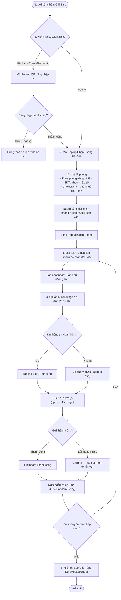

# Quy Tắc & Kiến Trúc Gửi Phiếu Thu Qua Zalo An Toàn

Tài liệu này ghi lại toàn bộ quy ước kỹ thuật, kiến trúc dữ liệu và các nguyên tắc an toàn **BẮT BUỘC** phải tuân thủ mỗi khi AI Agent hoặc lập trình viên làm việc với tính năng **Gửi Phiếu Thu / Hóa Đơn qua Zalo** trong dự án Quản Lý Phòng Trọ.

---

# PHẦN I: HIỆN TRẠNG HỆ THỐNG & CÁC THÀNH PHẦN ĐÃ CODE THẬT

Phần này ghi lại chính xác cấu trúc dữ liệu, các hàm, class và kênh IPC **đã được triển khai thật** trong mã nguồn dự án.

## 1. Cấu Trúc Dữ Liệu Thực Tế

### 1.1. Hồ sơ người thuê (`residents.json`)
Vị trí: `data/residents.json` hoặc `<baseFolder>/data/residents.json`.
```json
{
  "id": "person_1788676064549",
  "hoTen": "Lê Công Bá Nhân",
  "cccd": "051209000152",
  "sdtGoi": "0978141407",
  "sdtZalo": "0978141407",
  "ngaySinh": "31/01/2009",
  "gioiTinh": "Nam",
  "email": "...",
  "ngayVaoO": "06/09/2026",
  "phong": "1A"
}
```
- **SĐT Zalo**: Lưu tại `sdtZalo`. Nếu `sdtZalo` để trống, fallback sang `sdtGoi`.
- **Định dạng SĐT**: Chuỗi 10 số (VD: `0978141407`).

### 1.2. Danh sách 12 phòng (`rooms.json`)
Vị trí: `data/rooms.json` hoặc `<baseFolder>/data/rooms.json`. Cố định 12 phòng từ `1A` đến `6A`, `1B` đến `6B`:
```json
{
  "phong": "1A",
  "tenKhach": "Lê Công Bá Nhân",
  "cmnd": "051209000152",
  "chuPhong": "person_1788676064549",
  "thanhVien": []
}
```
- `chuPhong`: ID của người đại diện phòng (`person_id`), là người chịu trách nhiệm nhận hóa đơn và thanh toán.
- Nếu `chuPhong === null` hoặc rỗng: Phòng trống hoặc chưa được gán người đại diện.

### 1.3. Lịch sử chỉ số tháng (`history/YYYY-MM.json`)
Vị trí: `<baseFolder>/data/history/YYYY-MM.json` (VD: `2026-07.json`).
```json
[
  { "phong": "1A", "dienCu": 5302, "dienMoi": 5379, "nuocCu": 577, "nuocMoi": 583 }
]
```
- Tính toán đầy đủ qua hàm `calcRoom(roomData, appSettings)` trong [`src/shared/calc.js`](file:///d:/2.%20GauGau/Project-tools-phongtro/src/shared/calc.js).
- Ánh xạ sang cấu trúc phiếu thu qua `toReceiptData(calcResult, monthKey, dienThoai)` trong [`src/shared/format.js`](file:///d:/2.%20GauGau/Project-tools-phongtro/src/shared/format.js).

### 1.4. Cấu hình ngân hàng nhận tiền (`settings.json` & `banks-data.js`)
Nằm trong `appSettings` tại `<baseFolder>/data/settings.json`:
```json
{
  "bankName": "MB",
  "bankAccount": "0982141407",
  "bankOwner": "NGUYEN VAN A"
}
```
- `bankName`: Mã định danh ngân hàng (VD: `MB`, `VCB`, `CTG`, `BIDV`, `TCB`...).
- Tra cứu thông tin ngân hàng qua `VIETNAM_BANKS_MAP` trong [`src/shared/banks-data.js`](file:///d:/2.%20GauGau/Project-tools-phongtro/src/shared/banks-data.js) để lấy mã `bin`, `shortName`, `name`, `bankLogoUrl`.

---

## 2. Module & API Xác Thực Zalo Đã Code Thật

Toàn bộ phần kết nối, quản lý session và giao diện đăng nhập Zalo đã được code và kiểm thử:

### 2.1. Backend Class `ZaloManager` ([`electron/zalo-manager.js`](file:///d:/2.%20GauGau/Project-tools-phongtro/electron/zalo-manager.js))
- Quản lý phiên làm việc với thư viện `zca-js`.
- File lưu session: `app.getPath('userData')/zalo_session.json` (chính) và `<baseFolder>/data/zalo_session.json` (sao lưu).
- Các phương thức chính:
  - `loadSavedSession(baseFolder)`: Đọc session từ ổ đĩa.
  - `saveSession(sessionData, baseFolder)`: Lưu cookie/credentials và profile xuống file.
  - `clearSession(baseFolder)`: Xóa file session và đặt lại trạng thái ngắt kết nối.
  - `restoreSession(baseFolder)`: Khôi phục ngầm session khi khởi động app.
  - `startQrLogin(webContents, baseFolder)`: Mở luồng quét QR thời gian thực, stream event qua IPC `zalo:qr-event`.
  - `abortQrLogin()`: Hủy tiến trình chờ quét QR an toàn qua `actions.abort()`.
  - `retryQrLogin(webContents, baseFolder)`: Tạo lại mã QR mới qua `actions.retry()`.
  - `getStatus()`: Trả về `{ connected, profile, isLoginInProgress }`.

### 2.2. Kênh IPC & Preload APIs ([`electron/main.js`](file:///d:/2.%20GauGau/Project-tools-phongtro/electron/main.js) & [`electron/preload.js`](file:///d:/2.%20GauGau/Project-tools-phongtro/electron/preload.js))
Danh sách API phơi ra cho Renderer Process qua `window.api`:
- `window.api.getZaloStatus()`: Gọi channel `zalo:get-status`.
- `window.api.startZaloQrLogin()`: Gọi channel `zalo:start-qr-login`.
- `window.api.abortZaloQrLogin()`: Gọi channel `zalo:abort-qr-login`.
- `window.api.retryZaloQrLogin()`: Gọi channel `zalo:retry-qr-login`.
- `window.api.logoutZalo()`: Gọi channel `zalo:logout`.
- `window.api.onZaloQrEvent(callback)`: Lắng nghe channel `zalo:qr-event`.

### 2.3. Frontend Renderer Functions ([`src/input/renderer.js`](file:///d:/2.%20GauGau/Project-tools-phongtro/src/input/renderer.js))
- `initZaloIntegration()`: Khởi tạo kiểm tra session ngầm lúc tải trang.
- `updateZaloProfileUI(isConnected, profile)`: Cập nhật Avatar thật, Tên thật, SĐT và Badge trạng thái trên Card Cài Đặt Chung.
- `openZaloQrModal(isSwitchMode)`: Mở modal `#zalo-qr-modal` và khởi chạy quét QR.
- `handleZaloQrLoginClick()`: Xử lý bấm "Đăng Nhập Bằng Mã QR".
- `handleZaloSwitchAccountClick()`: Xử lý bấm "Đổi Tài Khoản".
- `handleZaloLogoutClick()`: Xử lý bấm "Đăng Xuất".
- `cancelZaloQrLogin()`: Xử lý đóng modal / hủy tiến trình QR (xóa sạch QR tạm trong DOM, dừng countdown, gọi `abortZaloQrLogin()`).
- `retryZaloQrLogin()`: Tạo mã QR mới khi mã hết hạn.
- `handleZaloQrStreamEvent(event)`: Xử lý các sự kiện `generating`, `qr_generated`, `qr_scanned`, `qr_expired`, `qr_declined`, `confirming`, `success`, `aborted`, `error`.
- `startZaloCountdown(120)` / `stopZaloCountdown()` / `clearZaloQrImage()`: Đồng hồ đếm ngược 2 phút và xóa sạch ảnh QR tạm sau khi kết thúc.
- `handleSendZaloMonthClick()`: **Hiện tại là nút placeholder** trên header Bảng nhập chỉ số (Phần 1).

---

# PHẦN II: THIẾT KẾ & QUY TẮC CHO TÍNH NĂNG GỬI TIN TỰ ĐỘNG (CHƯA CODE)

> [!IMPORTANT]
> **LƯU Ý BẮT BUỘC**: Toàn bộ nội dung dưới đây là **bản thiết kế kỹ thuật dự kiến** cho tính năng gửi phiếu thu tự động qua Zalo. Tính năng này **CHƯA ĐƯỢC TRIỂN KHAI TRONG CODE** (hiện tại mới chỉ có phần đăng nhập/quản lý tài khoản Zalo).
> Khi bắt đầu triển khai code thật, **BẮT BUỘC PHẢI XÁC NHẬN LẠI VỚI NGƯỜI DÙNG** trước khi áp dụng.

## 3. QUY TẮC 1: Kiểm Tra Trạng Thái Đăng Nhập Trước Khi Mở Popup Chọn Phòng

> [!WARNING]
> Tuyệt đối không mở popup chọn phòng hoặc gửi tin khi chưa xác minh session Zalo sống.

Khi người dùng bấm nút **"Gửi Zalo"** (`#btn-send-zalo-month`):
1. **Kiểm tra session**: Gọi `await window.api.getZaloStatus()`.
2. **Nếu session hợp lệ (`connected === true`)**: Mở ngay **Popup Chọn Phòng Để Gửi** (Quy tắc 2).
3. **Nếu session KHÔNG hợp lệ hoặc đã hết hạn**:
   - Tự động mở modal QR bằng `openZaloQrModal(false)`.
   - Hiển thị thông báo: *"Phiên đăng nhập Zalo đã hết hạn. Vui lòng quét mã QR để tiếp tục gửi phiếu thu."*.
   - **CHỈ MỞ POPUP CHỌN PHÒNG** sau khi người dùng quét mã và đăng nhập thành công.
   - Nếu người dùng bấm "x" hoặc "Hủy Bỏ": Dừng toàn bộ tiến trình an toàn, không mở popup chọn phòng.
4. **Nếu mất kết nối mạng / lỗi hệ thống**: Dừng lại ngay lập tức, hiển thị thông báo tiếng Việt rõ ràng.

---

## 4. QUY TẮC 2: Thiết Kế Popup Chọn Phòng Để Gửi (Thay Cho Cơ Chế Skip Ngầm)

> [!NOTE]
> Thay vì hệ thống tự động xử lý ngầm cả 12 phòng và tự skip, bấm "Gửi Zalo" sẽ mở 1 Popup cho người dùng tự tick chọn phòng muốn gửi phiếu thu tháng đang xem.

### 4.1. Cấu trúc và giao diện Popup Chọn Phòng
- **Danh sách 12 phòng**: Hiển thị danh sách 12 phòng dạng checkbox / list trực quan (từ `1A` đến `6A`, `1B` đến `6B`).
- **Phòng BỊ KHÓA / MỜ (Disabled Checkbox)**: Không cho tick chọn, kèm dòng lý do hiển thị rõ ràng ngay trên hàng của phòng đó trong các trường hợp sau:
  1. **Phòng trống (không có chủ phòng)** $\rightarrow$ Lý do hiển thị: `Phòng trống, chưa có chủ phòng`.
  2. **Chủ phòng chưa có SĐT Zalo hợp lệ** $\rightarrow$ Lý do hiển thị: `Chủ phòng chưa có SĐT Zalo`.
  3. **Tháng này chưa nhập đủ điện/nước (chưa có tổng tiền > 0)** $\rightarrow$ Lý do hiển thị: `Chưa nhập đủ chỉ số điện/nước tháng này`.
- **Phòng ĐỦ ĐIỀU KIỆN (Hợp lệ)**:
  - Cho phép người dùng tick chọn tự do từng phòng.
  - Có nút **"Chọn Tất Cả"** (tự động tick toàn bộ các phòng đủ điều kiện) và **"Bỏ Chọn Tất Cả"**.
- **Không cảnh báo gửi lại**: **KHÔNG** cần kiểm tra / cảnh báo phòng đã gửi trong tháng trước đó $\rightarrow$ Cho phép gửi lại bình thường mà không cần hỏi xác nhận thêm.
- **Ràng buộc nút bấm**: Nút **"Xác Nhận Gửi"** chỉ được bật (enable) khi có **ít nhất 1 phòng** được chọn.

---

## 5. QUY TẮC 3: Quy Trình Sau Khi Xác Nhận Gửi & Bộ Đếm Tiến Trình

### 5.1. Đóng Popup & Hiển thị bộ đếm đơn giản
- Ngay khi người dùng bấm **"Xác Nhận Gửi"**:
  1. Đóng Popup chọn phòng.
  2. Khóa nút gửi trên màn hình chính và hiển thị trạng thái đang gửi dạng đếm số đơn giản:
     - Nhãn hiển thị: **"Đang gửi {n}/{tổng số đã chọn}..."** (VD: *"Đang gửi 1/5..."* $\rightarrow$ *"Đang gửi 2/5..."*).
     - **KHÔNG CẦN** hiển thị bảng danh sách trạng thái từng phòng theo thời gian thực, chỉ cần bộ đếm tiến trình này.

### 5.2. Gửi tuần tự & Độ trễ ngẫu nhiên (Random Delay)
- **Gửi tuần tự từng phòng** (`for...of`), tuyệt đối **KHÔNG dùng `Promise.all`** hay gửi song song nhiều phòng cùng lúc.
- **Độ trễ ngẫu nhiên (Anti-Ban Random Delay)**: Giữa mỗi lần gửi liên tiếp, **BẮT BUỘC** chèn khoảng nghỉ ngẫu nhiên trong khoảng **3.0 đến 4.5 giây** bằng `Math.random()` (không dùng số cố định):
  ```javascript
  // Random delay từ 3000ms đến 4500ms
  const randomDelayMs = Math.floor(Math.random() * (4500 - 3000 + 1)) + 3000;
  await new Promise(resolve => setTimeout(resolve, randomDelayMs));
  ```
- **Timeout bảo vệ**: Tối đa **15 giây cho mỗi phòng**. Quá 15s tự động ghi nhận lỗi timeout phòng đó và chuyển sang phòng tiếp theo.

### 5.3. Xử lý VietQR & Thông tin ngân hàng
- Nếu `settings.bankName`, `bankAccount`, `bankOwner` trong Cài Đặt Chung đầy đủ: Tự động tạo ảnh VietQR chuyển khoản.
- Nếu thiếu bất kỳ trường ngân hàng nào: **KHÔNG tạo VietQR**, chuyển sang gửi tin nhắn văn bản / ảnh phiếu thu không kèm VietQR.

---

## 6. QUY TẮC 4: Sơ Đồ Luồng Hoạt Động (Mermaid Flowchart)



---

## 7. QUY TẮC 5: Báo Cáo Tổng Kết Cuối Cùng

Sau khi gửi xong toàn bộ các phòng đã chọn, hệ thống **BẮT BUỘC** hiển thị popup / modal Báo Cáo Kết Quả để chủ trọ nắm rõ:
- Tổng số phòng gửi thành công.
- Danh sách các phòng gửi thất bại kèm **lý do lỗi cụ thể phát sinh trong lúc gửi thật** (ví dụ: Lỗi rớt mạng khi gửi, SĐT chưa đăng ký Zalo khi gọi `api.findUser`... — khác với các lý do bị khóa ở bước chọn phòng ban đầu).

```text
==================================================
KẾT QUẢ GỬI PHIẾU THU THÁNG {MM}/{YYYY}
==================================================
✅ Gửi thành công: 4 / 5 phòng đã chọn
❌ Gửi thất bại: 1 phòng

Chi tiết phòng thất bại:
- Phòng 5A: SĐT [0912345678] chưa đăng ký tài khoản Zalo.
==================================================
```

---

## 8. QUY TẮC 6: Mẫu Tin Nhắn

> đảm bảo gửi ảnh phiếu thu trước -> xong rồi gửi mã vietqr đính kèm -> xong rồi gửi các thông tin text
> có thể thêm 1 khoảng delay nhỏ ở mỗi lần gửi. ~0.2-1s gì đó.
> khoảng delay 0.2-1s này sẽ dùng random.

```text
- Ảnh phiếu thu đính kèm
- Ảnh vietqr đính kèm

📋 HÓA ĐƠN PHÒNG {SoPhong} - THÁNG {MM}/{YYYY}

💰 TỔNG: {TongCong} đ

💳 THÔNG TIN CHUYỂN KHOẢN
- Ngân hàng: {TenNganHang}
- Số tài khoản: {SoTaiKhoan}
- Chủ tài khoản: {ChuTaiKhoan}
- ND CK: {TenChuPhong} phòng {SoPhong} tháng {MM}/{YYYY}

(Chi tiết xem ảnh phiếu thu đính kèm)
```

---

## 9. Những Điều TUYỆT ĐỐI CẤM Khi Code Tính Năng Gửi Zalo

1. **CẤM gửi tin nhắn song song (`Promise.all`)**: Bắt buộc gửi tuần tự `for...of` với độ trễ ngẫu nhiên 3.0s - 4.5s giữa các phòng.
2. **CẤM tự động gửi ngầm cả 12 phòng mà không qua Popup chọn phòng**: Người dùng phải có quyền chủ động tick chọn phòng muốn gửi.
3. **CẤM cho phép tick chọn các phòng chưa đủ điều kiện**: Phòng trống, thiếu SĐT Zalo hoặc chưa nhập đủ điện nước phải bị khóa kèm lý do rõ ràng.
4. **CẤM nuốt lỗi ngầm (Silent fail)**: Mọi phòng gửi lỗi trong quá trình gửi thật đều phải được ghi nhận lý do và hiển thị trong bảng báo cáo tổng kết cuối cùng.
5. **CẤM sửa công thức tính tiền trong `calc.js` hay `format.js`** khi làm luồng gửi tin.
